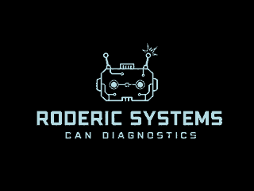

# Roderic Systems RoadLink



RoadLink is an ESP32-based vehicle interface that combines CAN-bus monitoring, OBD-II diagnostics, GPS telemetry, a rotary-controlled TFT display, and a local phone-friendly web dashboard.

The project is designed as a standalone diagnostic and telemetry platform. It starts in CAN listen-only mode and uses one renderer-independent UI model for the physical display, WebSocket dashboard, and optional serial mirror.

## Highlights

- Passive CAN monitoring, identifier browsing, and bus statistics
- Standard 11-bit ISO 15765-4 OBD-II requests
- ECU discovery, live PIDs, DTC reading/clearing, and VIN retrieval
- GPS position, motion, time, PPS, and NMEA statistics
- 320×240 ILI9341 TFT interface
- Single rotary encoder navigation with explicit Back actions
- Local ESP32 Wi-Fi access point and live WebSocket dashboard
- Roderic Systems splash screen and startup diagnostics
- Shared SPI bus for the TFT and MCP2515 using independent chip-select pins

## Repository layout

```text
assets/                  Splash artwork and project media
docs/
  ARCHITECTURE.md        Detailed software and hardware architecture
  CHANGELOG.txt          Implementation history
  GETTING_STARTED.md     Wiring, dependencies, and first upload
firmware/
  RoadLink/              Arduino sketch and all firmware modules
```

## Quick start

1. Install the ESP32 Arduino board package.
2. Install `mcp_can`, `WebSockets`, `Adafruit GFX Library`, and `Adafruit ILI9341`.
3. Open `firmware/RoadLink/RoadLink.ino` in Arduino IDE.
4. Confirm the GPIO assignments in `AppConfig.h`.
5. Select the correct ESP32 board and serial port, then compile and upload.

See [Getting Started](docs/GETTING_STARTED.md) for the confirmed wiring and complete first-boot checklist.

## Boot flow

1. The splash screen remains visible until the encoder is pressed.
2. RoadLink initializes and displays the module diagnostics.
3. Completed diagnostics remain visible for three seconds.
4. Pressing the encoder during those three seconds skips directly to the main interface.

## Current hardware profile

The included configuration targets:

- ESP32 development board
- MCP2515 CAN controller
- ILI9341-compatible 2.4-inch SPI TFT
- Rotary encoder with push button
- UART GPS receiver with PPS

The tested TFT control pins are CS `GPIO12`, DC `GPIO14`, and RESET `GPIO15`.

## PCB development
The pcb was custom developed in EasyEDAPRO.

attached pcb design screenshot:


### Construction


## Safety

RoadLink interfaces with automotive networks. Validate wiring, voltage levels, grounding, and CAN termination before connecting it to a vehicle. Keep the controller in listen-only mode unless active transmission is intentional and understood. Do not operate the interface while driving.

## Project status

RoadLink is an active hardware project. The source has received host-side consistency checks, but final behavior depends on the exact ESP32 board, display clone, CAN controller, library versions, wiring, and target vehicle.

Built by **Roderic Systems**.
