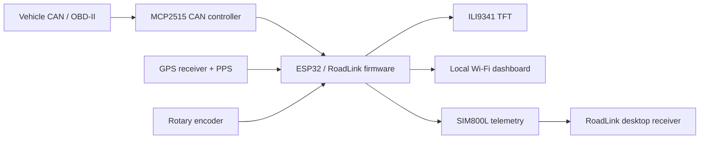

# Roderic Systems RoadLink


**RoadLink is a custom ESP32 vehicle diagnostics and telemetry platform built
around a purpose-designed carrier PCB.** It combines CAN and OBD-II tools, GPS
tracking, a rotary-controlled TFT interface, a local phone dashboard, and
optional SIM800L cellular telemetry in one standalone unit.

The system starts in CAN listen-only mode and keeps its hardware services
separate from the visible interface. A single UI model drives the physical
display, browser dashboard, and optional serial mirror, so every control surface
shows the same state.

> **Development status:** `main` contains the project documentation and baseline
> release. The current firmware and diagnostic utilities are published on
> [`codex/current-build-tools`](https://github.com/RodBot9999/roderic-systems-roadlink/tree/codex/current-build-tools).

## PCB design and construction

RoadLink began as a way to replace a loose collection of development boards and
test wiring with one organized, serviceable prototype. The carrier PCB places
the ESP32 at the center of the system and provides dedicated connections for the
CAN controller, GPS receiver, TFT, rotary encoder, SIM800L, power filtering, and
logic-level conditioning. The PCB was designed in **EasyEDA Pro** and then
assembled as the working RoadLink prototype.

The board was designed around practical pin use:

- The ILI9341 TFT and MCP2515 share the SPI clock and data lines, while separate
  chip-select pins keep the two peripherals independent.
- GPS and SIM800L use separate hardware UARTs, allowing both services to run
  without blocking CAN processing or the interface.
- The rotary encoder provides complete local navigation without requiring a
  phone or computer.
- Bulk capacitance and short power paths are placed near high-demand modules,
  while voltage-level handling is kept explicit for modules such as the
  SIM800L.
- GPIO assignments in `AppConfig.h` reflect the assembled prototype and the
  pins that worked reliably during hardware testing, rather than a generic
  development-board example.

This remains a prototype carrier rather than an automotive-qualified control
unit. Vehicle power protection, enclosure design, environmental validation, and
safe CAN connection practices are still required for permanent installation.

### PCB layout

The EasyEDA Pro layout organizes the removable modules and user interface around
the ESP32 while keeping shared buses and power routing visible and serviceable.


### Assembled prototype

The construction below shows the design populated with the ESP32, display,
communications modules, level conversion, and local power filtering.


## System overview



## Highlights

- Passive CAN monitoring, identifier browsing, and bus statistics
- Standard 11-bit ISO 15765-4 OBD-II requests
- ECU discovery, live PIDs, DTC reading and clearing, and VIN retrieval
- GPS position, motion, time, PPS, and NMEA statistics
- 320x240 ILI9341 TFT interface
- Single rotary encoder navigation with explicit Back actions
- Local ESP32 Wi-Fi access point and live WebSocket dashboard
- SIM800L HTTP telemetry with TFT-edited, NVS-persisted receiver settings
- Independent GPS and OBD-II telemetry selection
- Windows telemetry monitor with JSONL logging and temporary port mapping
- Startup diagnostics that report optional-module warnings without blocking boot
- Shared SPI bus for the TFT and MCP2515 with independent chip-select pins

## Confirmed prototype wiring

| Function | ESP32 GPIO |
|---|---:|
| Encoder CLK / DT / button | 25 / 26 / 27 |
| GPS PPS / RX / TX | 34 / 35 / 32 |
| SIM800L RST / RX / TX | 2 / 17 / 16 |
| MCP2515 CS / INT | 23 / 4 |
| Shared SPI SCK / MISO / MOSI | 5 / 19 / 18 |
| TFT CS / DC / RESET | 12 / 14 / 15 |

UART directions are named from the ESP32 perspective: GPIO16 transmits to the
SIM800L RX input, while GPIO17 receives from the SIM800L TX output. See
[Getting Started](docs/GETTING_STARTED.md) before wiring hardware.

## Software architecture

Hardware and protocol services update independently in the main loop. They
publish snapshots rather than drawing screens directly:

```text
CAN / OBD / GPS / SIM services
              |
              v
          MenuSystem
              |
              v
           UiModel
          /   |    \
         v    v     v
       TFT   Web   Serial
```

The SIM800L implementation follows the same modular pattern and uses a
non-blocking AT-command state machine. A missing modem or GPS receiver produces
a startup warning but does not prevent the main menu from opening.

## Repository layout

```text
assets/                         Splash artwork and project media
docs/
  ARCHITECTURE.md               Hardware and software architecture
  CHANGELOG.txt                 Implementation history
  GETTING_STARTED.md            Wiring, dependencies, and first upload
  SIM800L_TELEMETRY.md          Cellular sender and receiver setup
firmware/
  RoadLink/                     Arduino sketch and firmware modules
tools/                         Current-build branch
  roadlink_monitor/             Windows GPS/OBD telemetry receiver
  SIM800L_Baud_Terminal/        Standalone modem baud scanner and AT terminal
```

## Quick start

1. Install Arduino IDE 2.x and the Espressif ESP32 board package.
2. Install `mcp_can`, `WebSockets`, `Adafruit GFX Library`, and
   `Adafruit ILI9341`.
3. Open `firmware/RoadLink/RoadLink.ino`.
4. Confirm the GPIO assignments in `AppConfig.h`.
5. Select the correct ESP32 board and serial port.
6. Compile and upload, then open Serial Monitor at 115200 baud.

The splash waits for an encoder press. Startup diagnostics then check the core
services and advance automatically after three seconds; pressing the encoder
skips the remaining diagnostic delay.

For the complete bring-up procedure, see
[Getting Started](docs/GETTING_STARTED.md). Cellular configuration and power
requirements are documented in
[SIM800L Telemetry](docs/SIM800L_TELEMETRY.md).

## Safety

RoadLink interfaces with automotive networks. Validate voltage levels,
grounding, CAN termination, power protection, and wiring before connecting it
to a vehicle. Keep the controller in listen-only mode unless active
transmission is intentional and understood. Do not configure or operate the
device while driving.

RoadLink is an active hardware and firmware project built by
**Roderic Systems**.
